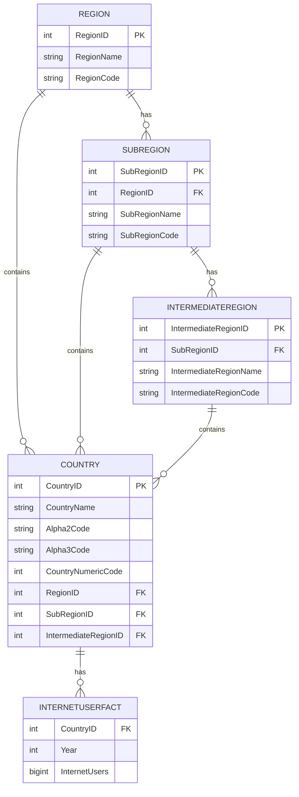

```mermaid
erDiagram
    REGION ||--o{ SUBREGION : has
    SUBREGION ||--o{ INTERMEDIATEREGION : has
    REGION ||--o{ COUNTRY : contains
    SUBREGION ||--o{ COUNTRY : contains
    INTERMEDIATEREGION ||--o{ COUNTRY : contains
    COUNTRY ||--o{ INTERNETUSERFACT : has

    REGION {
        int RegionID PK
        string RegionName
        string RegionCode
    }

    SUBREGION {
        int SubRegionID PK
        int RegionID FK
        string SubRegionName
        string SubRegionCode
    }

    INTERMEDIATEREGION {
        int IntermediateRegionID PK
        int SubRegionID FK
        string IntermediateRegionName
        string IntermediateRegionCode
    }

    COUNTRY {
        int CountryID PK
        string CountryName
        string Alpha2Code
        string Alpha3Code
        int CountryNumericCode
        int RegionID FK
        int SubRegionID FK
        int IntermediateRegionID FK
    }

    INTERNETUSERFACT {
        int CountryID FK
        int Year
        bigint InternetUsers
    }
```