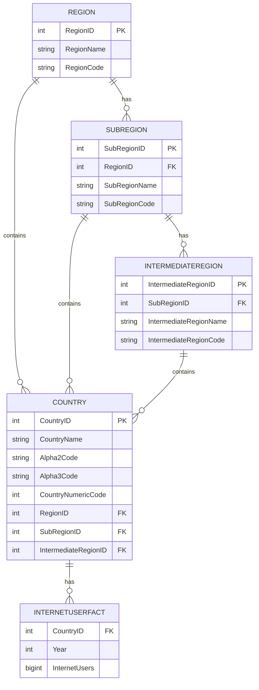

# M11305203_LeeYuHsien

Final exam repository for course CT5805701 (Software Engineering in Construction Information Systems)

## Internet Users Analysis Platform

This project is a three-tier web application developed as a final exam for the Database Systems course.

The system analyzes the **Number of Internet Users** across countries, regions, and years using a normalized relational database, SQL-based ETL, and a modern web stack.

---

## Database Design & Normalization

The database was designed based on two CSV datasets and normalized to **Third Normal Form (3NF)**.

## Main Entities
- Region
- SubRegion
- IntermediateRegion
- Country
- InternetUserFact

---

## E-R model




---

## ETL Process

- Raw CSV files are first loaded into staging tables.
- Data is cleaned and transformed using SQL.
- Invalid or incomplete records are removed.
- Data is then inserted into normalized tables.

All ETL steps are documented in `ETL.sql` with detailed comments.

---

## Web Application Features

### Feature 1: Country Timeline
Select a country to view its Internet Users over the years (ordered by year descending).

### Feature 2: Sub-region by Year
Select a sub-region and a year to list all countries in that sub-region with their Internet Users (ascending order).

### Feature 3: Region Summary by Year
Select a region and a year to display all sub-regions and their total Internet Users.

### Feature 4: Country Keyword Search
Search countries by partial name and view their Internet Users in the most recent available year.

### Feature 5: Add Record
Add a new Internet Users record for the next year of a selected country.

### Feature 6: Update Record
Update the Internet Users value for a selected country and year.

### Feature 7: Delete Records
Delete Internet Users records for a selected country within a specified year range.

### Feature 8: Country Growth (Custom Feature)
Display year-over-year growth of Internet Users for a selected country, including:
- Current year users
- Previous year users
- Growth difference

---

## Deployment

To run the application:

```bash
git clone <repository-url>
docker compose up
```
